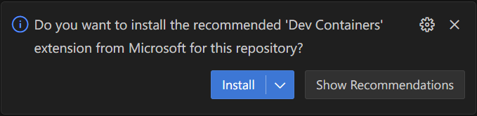
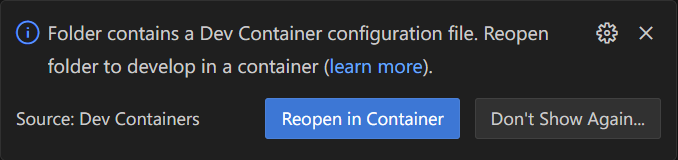
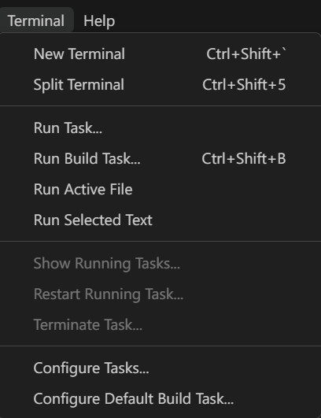
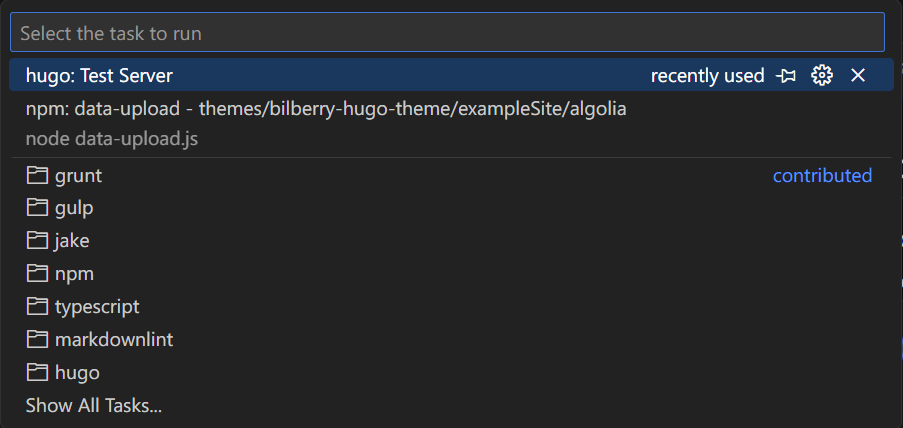

# How to use this repository

## First

```bash
git clone --recursive https://github.com/rits-menglab/news.git
```

> [!IMPORTANT]
> If you forget to run `--recursive`, you can run the following command to clone correctly.
>
> ```bash
> git submodule update --init --recursive
> ```

## Devcontainer VSCode

1. Now you open the repository in VSCode.  
1. Click the `Install` button in the bottom right corner to install Extension.  
  
1. Click the `Reopen in Container` button in the bottom right corner to open the repository in a Devcontainer.
    

## Testing website

1. `Terminal` -> `Run Task`  
     
1. `hugo: Test server`  
  
1. Open the browser and go to `http://localhost:1313/news/` to test the website

## How to add new article

**You just only add `content/(what-you-want-category)/(what-you-want-folder-name)/index.md`**

> [!IMPORTANT]
> Please be careful `slug` is parameter of the URL.
>
> ```Markdown
> ---
> title: "Your wonderful title"
> slug: "HERE!!!!!!!!!!!"
> date: 20XX-XX-XX
> archives: ['20XX']
> 
> categories: ['your-wonderful-category']
> tags: ['your-wonderful-tag']
> author: "Your name"
> ---
> ```

If you want to know other tricks, please refer to existing articles.

## How to deploy

Run the following command

```bash
hugo && rsync -avz --delete public/ user-name-of-server@ip.addr.of.server:/path/to/your/website
```
